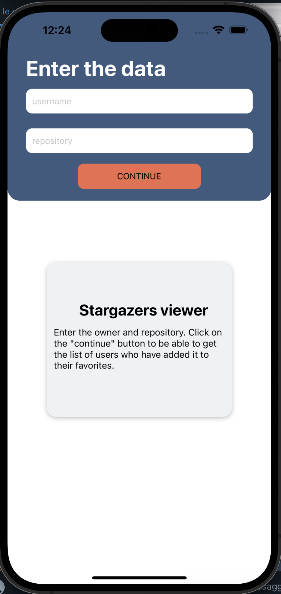
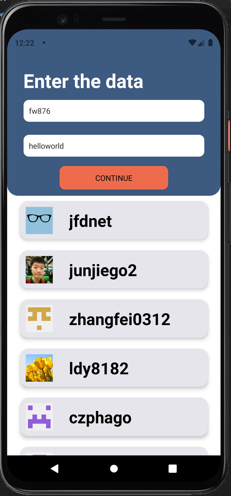
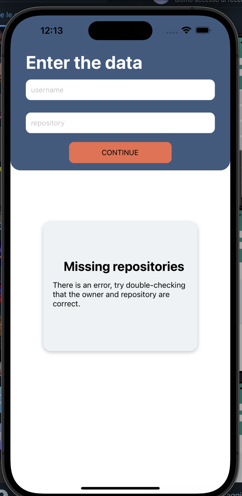

# StargazersViewer-

The app allows the user to enter the owner and name of the repository and then display the list of users who have added the repository to their favorites, showing the avatar and username of each user. The application was built using Javascript as the programming language and the React Native framework. 

An API d GItHub was used to implement it, which enabled the acquisition of stragazers.  The API in question is as follows:
https://api.github.com/repos/owner/repository/stargazers

In which you have to go and specify the name of the owner and the repository you want.

Regarding the ui and ux it was decided to make the application on a single screen, since it turns out to be a very simple application with a single function. When starting the app this screen appears. At the top you can see that there is the section dedicated to data entry, namely the owner and repository. In the middle of the screen it was decided to include a brief description of the app, so as to simplify its use.

Once the data is entered, the list of stragazers will be displayed. The data entry section will remain equally, so that further research can be done. In case an owner or a non-existing repository is entered, it was thought to show a warning always in the middle of the application.

To start the application you need to download the folder from github and from terminal, place yourself inside the folder and enter the command "npx expo run ios" to start the application on an iOS simulator or "npx expo run Android" to start it on an android simulator.

